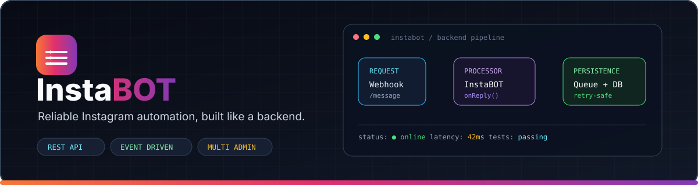

<div align="center">

<a href="https://github.com/saan-ngl/Saan-Insta-Bot">
  
</a>

# ⚡ Saan Insta Bot

**A high-performance, modular Instagram Direct chat bot platform powered by `ig-chat-api` and the Floppa / GoatBot V2 ecosystem.**

Send text, music stickers, animated text effects, photos, audio, and video with prefix commands, interactive multi-turn conversations (`onReply`, `onReaction`), roles, cooldowns, canvas image composites, and pluggable custom commands.

[](LICENSE)
[](https://nodejs.org/)
[](https://github.com/saan-ngl/Saan-Insta-Bot)

<p align="center">
  <a href="#-overview">Overview</a> •
  <a href="#-features">Features</a> •
  <a href="#-quick-start">Quick Start</a> •
  <a href="#-configuration">Configuration</a> •
  <a href="#-commands">Commands</a> •
  <a href="#-deployment">Deployment</a> •
  <a href="#-credits">Credits</a>
</p>

---

</div>

## 🌟 Overview

**Saan Insta Bot** is a modular Instagram Direct automation framework maintained under the **Saan** project.

The project combines an Instagram chat transport layer with a modular command/event architecture supporting media, utilities, games, AI integrations, moderation, interactive replies, and custom commands.

### 👑 Project

**𝐒𝐈𝐀𝐌 𝐀𝐇𝐌𝐄𝐃 𝐒𝐀𝐀𝐍**
**𝐒𝐀𝐀𝐍 𝐄𝐗𝐇𝐀𝐔𝐒𝐓𝐄𝐃**

Repository:

**https://github.com/saan-ngl/Saan-Insta-Bot**

---

## 🔥 Features

* ⚡ Modular Instagram Direct bot architecture
* 💬 Prefix-based commands
* 🔄 `onReply` and `onReaction` handlers
* 🎵 Music and audio support
* 🎥 Image/video/media sending
* 🎨 Canvas-based image generation
* 🤖 AI command integrations
* 🎮 Games and economy system
* 🛡️ Admin/moderation system
* 👑 Bot-admin and owner permissions
* 📊 Runtime/health monitoring
* 🔌 Custom command and event plugins
* 🚀 PM2/Docker deployment support
* 💾 Persistent user/thread data support
* ⚙️ Environment-variable configuration

---

# 🚀 Quick Start

## 1. Requirements

* Node.js **20+ LTS recommended**
* npm
* A dedicated Instagram account for bot usage
* Instagram session cookies

Check Node.js:

```bash
node -v
npm -v
```

---

## 2. Clone the Repository

```bash
git clone https://github.com/saan-ngl/Saan-Insta-Bot.git
cd Saan-Insta-Bot
```

Install dependencies:

```bash
npm install
```

---

## 3. Configure Environment

Create `.env`:

```env
PREFIX=-
PORT=8080

IG_COOKIES=

IG_API_SERVER=
IG_API_TOKEN=

IG_ADMIN_BOT=

INSTABOT_URL=
INSTABOT_TOKEN=
```

**Never commit `.env`, cookies, passwords, or API tokens.**

---

## 4. Instagram Session

Use a dedicated bot account.

Export the required Instagram session cookies using a trusted browser cookie-export method and configure them according to the project's authentication implementation.

Example:

```bash
cp account.txt.example account.txt
```

Then place the required session information in:

```text
account.txt
```

Make sure `account.txt` is included in `.gitignore`.

---

# ⚙️ Configuration

Example `config.json`:

```json
{
  "botName": "Saan Insta Bot",
  "prefix": "-",
  "language": "en",

  "devUsers": [],
  "adminBot": [],

  "defaultOff": true,

  "adminOnly": {
    "enable": true,
    "ignoreCommands": []
  },

  "welcome": {
    "enable": false,
    "message": "Welcome %1 to %2! 👋",
    "selfMessage": "Thanks for inviting me to %2 💋. Type {prefix}help to see available commands.",
    "threadIDs": []
  },

  "leave": {
    "enable": false,
    "message": "%1 left %2. 👋",
    "threadIDs": []
  },

  "server": {
    "url": "",
    "token": "",
    "timeout": 60000
  },

  "music": {
    "enable": true,
    "apiUrl": "",
    "apiToken": ""
  },

  "whiteList": {
    "enable": false,
    "userIDs": [],
    "threadIDs": []
  },

  "cooldown": {
    "default": 3
  }
}
```

---

# 🧩 Running the Bot

Development:

```bash
npm start
```

or, if the project provides a development script:

```bash
npm run dev
```

Testing:

```bash
npm test
```

---

# 👑 Permission System

| Level | Role         | Description                  |
| ----: | ------------ | ---------------------------- |
|     0 | User         | Normal public commands       |
|     1 | Thread Admin | Group/thread moderation      |
|     2 | Bot Admin    | Global bot administration    |
|     3 | Bot Owner    | Owner-only system operations |

Keep dangerous runtime commands such as `eval`, `shell`, and restart functionality restricted to trusted administrators.

---

# 📚 Core Commands

| Command      | Alias        | Description              |
| ------------ | ------------ | ------------------------ |
| `help`       | `h`, `menu`  | Command directory        |
| `ping`       | `pong`       | Connection/latency check |
| `uptime`     | `up`         | Runtime information      |
| `uid`        | `id`         | Get Instagram user ID    |
| `info`       | `whois`      | Profile information      |
| `pfp`        | `pp`         | Profile picture          |
| `echo`       | `say`        | Repeat text              |
| `effect`     | `fx`         | Instagram text effects   |
| `avatarfx`   | `avfx`       | Avatar effects           |
| `music`      | `m`          | Music search             |
| `sing`       | —            | Audio search             |
| `ai`         | `chatbot`    | AI conversation          |
| `img`        | `image`      | Send image               |
| `joke`       | `dadjoke`    | Random joke              |
| `roll`       | `dice`       | Dice game                |
| `admin`      | `adminbot`   | Manage bot admins        |
| `ban`        | `unban`      | Bot-level user ban       |
| `adduser`    | `addmember`  | Add group member         |
| `removeuser` | `kick`       | Remove group member      |
| `whitelist`  | `wl`         | Whitelist management     |
| `prefix`     | `setprefix`  | Change prefix            |
| `avatar`     | `setavatar`  | Change bot avatar        |
| `bio`        | `setbio`     | Change bot bio           |
| `cmd`        | `command`    | Command management       |
| `weather`    | `forecast`   | Weather information      |
| `translate`  | `trans`      | Translation              |
| `calc`       | `calculate`  | Calculator               |
| `time`       | `clock`      | World clock              |
| `github`     | `gh`         | GitHub information       |
| `screenshot` | `webshot`    | Web screenshot           |
| `stats`      | `statistics` | Bot statistics           |
| `restart`    | `reboot`     | Restart bot              |

Additional commands can be loaded from the project's `commands/` directory.

---

# 🛠️ Custom Commands

Create a JavaScript file inside:

```text
commands/
```

Example:

```javascript
module.exports = {
  config: {
    name: "hello",
    aliases: ["hi"],
    author: "𝐒𝐈𝐀𝐌 𝐀𝐇𝐌𝐄𝐃 𝐒𝐀𝐀𝐍",
    category: "custom",
    cooldown: 3,
    role: 0,
    description: "Say hello",
    usage: "{p}hello <name>"
  },

  onStart: async function ({ message, args }) {
    const name = args.join(" ") || "world";
    return message.reply(`Hello ${name}! 👋`);
  }
};
```

Restart the bot after adding the command unless the runtime supports hot-loading.

---

# 🔄 Interactive Reply Handler

Example:

```javascript
module.exports = {
  config: {
    name: "roll",
    aliases: ["dice"],
    category: "games",
    cooldown: 3,
    role: 0,
    description: "Roll dice"
  },

  onStart: async function ({
    message,
    args,
    setReplyHandler
  }) {
    const sides =
      Number(args[0]) > 1
        ? Math.floor(Number(args[0]))
        : 6;

    const value =
      1 + Math.floor(Math.random() * sides);

    const sent = await message.reply(
      `🎲 Rolled a d${sides}: ${value}`
    );

    setReplyHandler(
      async ({ replyMessage }) => {
        await replyMessage.reply(
          `You selected ${value}!`
        );
      },
      sent?.messageID
    );
  }
};
```

---

# 📁 Recommended Project Structure

```text
Saan-Insta-Bot/
├── commands/
├── events/
├── ica/
├── assets/
├── test/
├── config/
├── index.js
├── config.json
├── package.json
├── account.txt.example
├── .env.example
├── .gitignore
├── Dockerfile
└── README.md
```

---

# 🚢 Deployment

## PM2

```bash
npm install -g pm2

pm2 start index.js --name saan-instabot

pm2 save
pm2 startup
```

Check:

```bash
pm2 status
pm2 logs saan-instabot
```

---

## Docker

Build:

```bash
docker build -t saan-instabot .
```

Run:

```bash
docker run -d \
  --name saan-instabot \
  -p 8080:8080 \
  --env-file .env \
  saan-instabot
```

---

# ❤️ Credits & Attribution

### Project Maintainers

**𝐒𝐈𝐀𝐌 𝐀𝐇𝐌𝐄𝐃 𝐒𝐀𝐀𝐍**
**𝐒𝐀𝐀𝐍 𝐄𝐗𝐇𝐀𝐔𝐒𝐓𝐄𝐃**

Official repository:

https://github.com/saan-ngl/Saan-Insta-Bot

### Third-Party Projects

This project may use or be inspired by external open-source projects and libraries. Their original authors, licenses, and attribution notices should remain intact where required.

In particular, retain the appropriate attribution for:

* `ig-chat-api`
* `ig-chat-api-server`
* GoatBot V2 / Floppa ecosystem
* Other npm packages and open-source components included by the actual source code

See the corresponding licenses and source repositories for their respective terms.

---

<div align="center">

### ⚡ Saan Insta Bot

**𝐃𝐞𝐯𝐞𝐥𝐨𝐩𝐞𝐝 𝐛𝐲 𝐒𝐈𝐀𝐌 𝐀𝐇𝐌𝐄𝐃 𝐒𝐀𝐀𝐍**

**𝐒𝐀𝐀𝐍 𝐄𝐗𝐇𝐀𝐔𝐒𝐓𝐄𝐃**

<a href="https://github.com/saan-ngl/Saan-Insta-Bot">
⭐ GitHub Repository
</a>

</div>